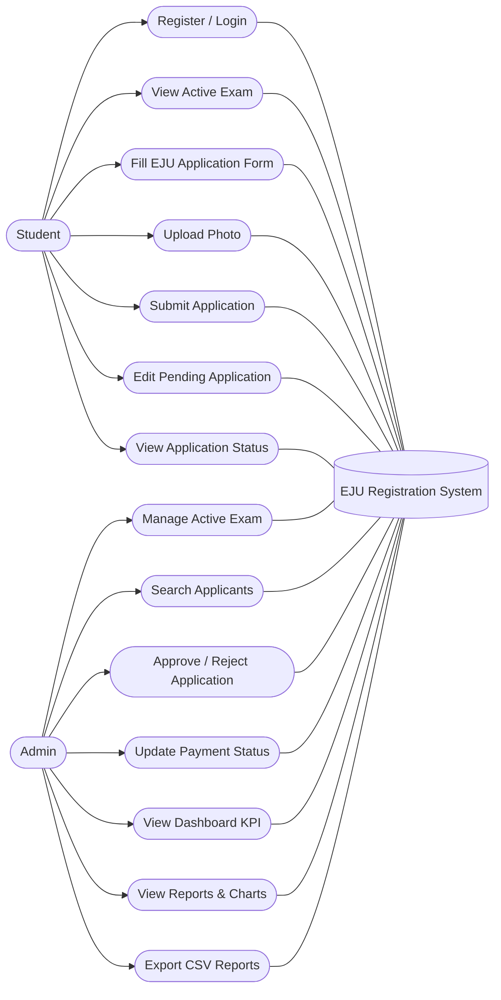
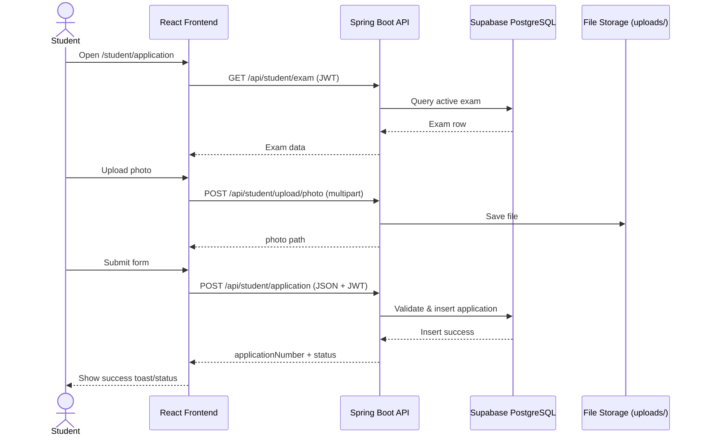
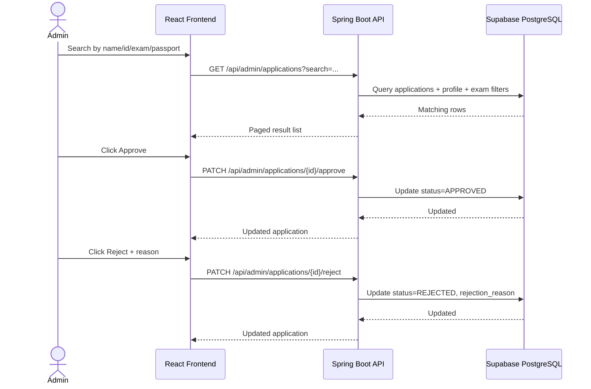
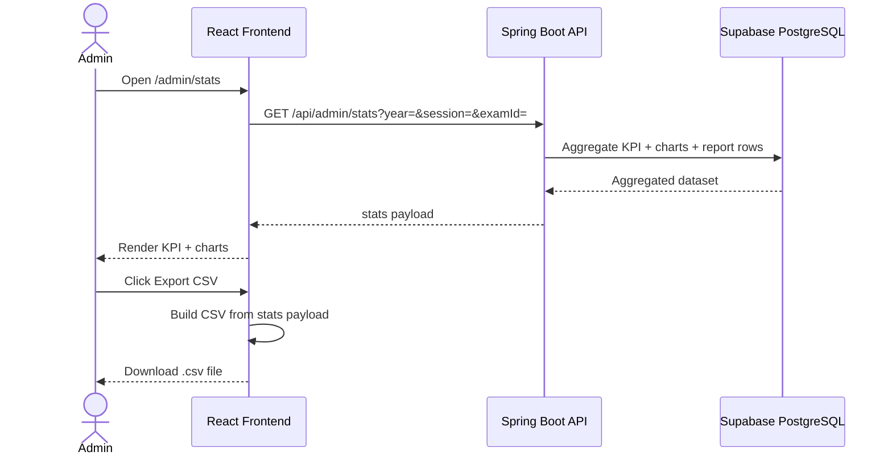
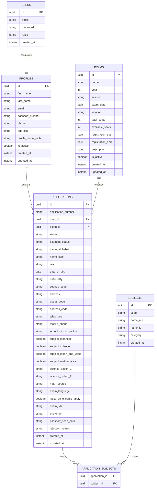

# EJU System Diagrams

This document contains:
1. Use Case Diagram
2. Sequence Diagrams
3. Database (ER) Diagram

## 1) Use Case Diagram

## 2) Sequence Diagrams

### 2.1 Student Application Submission

### 2.2 Admin Search + Approve/Reject

### 2.3 Admin Stats + CSV Export

## 3) Database (ER) Diagram

